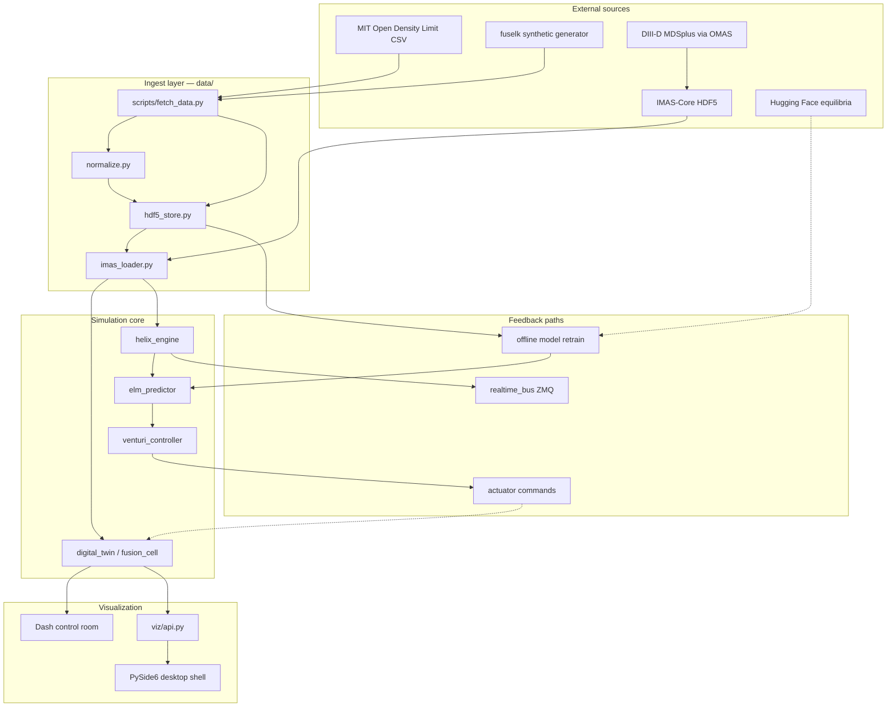

# Data pipeline — sources, ingest, simulation, feedback

This document is the canonical guide for **where fuselk data comes from**, **how to fetch it**, **what format it lands in**, and **how it flows through the simulation and control stack**.

Catalog file: [`config/data_sources.yaml`](../config/data_sources.yaml)

Fetch script: [`scripts/fetch_data.py`](../scripts/fetch_data.py)

---

## Quick start

```bash
# Fetch all public datasets (synthetic corpus + MIT Open Density Limit)
python scripts/fetch_data.py --all

# Or via CLI
fuselk data fetch --all

# Inspect what was downloaded
fuselk data manifest
fuselk data catalog

# Load a normalized shot
fuselk data import .fuselk-data/shots/CMOD_1000606012.h5

# Train ELM model on corpus, run GUI
fuselk train elm --shots 200
fuselk gui
```

Local layout after fetch:

```
.fuselk-data/
├── manifest.json              # provenance + checksums
├── catalog/sources.yaml       # snapshot of source catalog
├── raw/odl/DL_DataFrame.csv   # original MIT download
├── corpus/elm_corpus.npz      # HELIX features + ELM labels
└── shots/
    ├── SYN0042.h5             # synthetic IMAS-compatible shots
    └── CMOD_1000606012.h5     # real C-Mod discharge (normalized)
```

---

## End-to-end data flow



---

## Source catalog (summary)

| ID | Tier | Device | Format | Auto-fetch? | Primary fuselk use |
|----|------|--------|--------|-------------|-------------------|
| **synthetic** | generated | DIII-D-synthetic | fuselk HDF5 + npz | yes | HELIX, ELM training, GUI demo |
| **odl** | public | Alcator C-Mod | CSV | yes | Disruption/precursor labels, benchmarks |
| **imas_hdf5** | local | any | IMAS/fuselk HDF5 | import only | Digital twin shot replay |
| **mdsplus_d3d** | credentials | DIII-D | MDSplus → IMAS | no | Real ECE, equilibrium, control |
| **disruption_py** | credentials | multi-device | MDSplus/xarray | no | ML disruption datasets |
| **iterlike_equil** | public | ITER-like | Hugging Face | no | Equilibrium surrogate training |
| **constellaration** | public | stellarator | Hugging Face | no | Exploratory stellarator path |

Full metadata, URLs, and module mapping: `python scripts/fetch_data.py --list-sources`

---

## Source details

### 1. MIT Open Density Limit Database (public)

- **URL:** https://github.com/MIT-PSFC/open_density_limit_database
- **License:** CC-BY
- **What it is:** Alcator C-Mod experimental scalars on a 10 ms timebase with binary `density_limit_phase` labels (stable vs density-limit precursor).
- **Download:** CSV from GitHub raw (no account required).
- **Normalization:** `odl_csv_to_shots()` groups by `discharge_ID`, builds radial ne/Te/q/ω profiles from scalars, and pairs with a deterministic synthetic ECE `heat_field` so HELIX has 2D input.
- **Where it goes:** `.fuselk-data/shots/CMOD_<discharge>.h5` with `odl_meta/` group for labels.
- **Modules fed:** `models.elm_predictor`, `models.disruption_detector`, benchmarks.

### 2. fuselk synthetic corpus (generated)

- **Origin:** `sim.shot_corpus.generate_corpus()` + `synthetic_imas_shot()`
- **What it is:** HELIX focal features with island-amplitude-derived ELM labels.
- **Where it goes:** `.fuselk-data/corpus/elm_corpus.npz` + `shots/SYN*.h5`
- **Modules fed:** `train elm`, live dashboard, unit tests, desktop GUI.

### 3. IMAS / MDSplus (collaboration access)

- **Tools:** [IMAS-Core](https://github.com/iterorganization/IMAS-Core), [OMAS](https://github.com/gafusion/omas), [imas_composer](https://github.com/GA-FDP/imas_composer)
- **Format:** IDS structures → export to fuselk HDF5 via `export_imas_hdf5()`
- **Example (DIII-D, requires access):**

```python
# Requires DIII-D MDSplus credentials — not run by default fetch
from omas import ODS
ods = ODS()
ods.load_machine("DIII-D", pulse=200000, paths=["equilibrium", "magnetics"])
# Map to fuselk IMASShot and export_imas_hdf5(...)
```

- **Modules fed:** `sim.digital_twin`, `helix.helix_engine`, `control.venturi_controller`

### 4. DisruptionPy (open framework, device-dependent access)

- **URL:** https://github.com/MIT-PSFC/disruption-py
- **What it is:** Physics-based disruption feature extraction from MDSplus; MAST workflows are fully open.
- **fuselk path:** Export features → join with `elm_corpus` schema or train `disruption_detector` directly.

### 5. Hugging Face equilibrium datasets (public)

- **ITER-like:** https://huggingface.co/datasets/matteobonotto/iterlike-equil-sample
- **Constellaration:** https://huggingface.co/datasets/proxima-fusion/constellaration
- **fuselk path:** Future surrogate / shape optimization; not yet wired into live shot replay.

---

## fuselk HDF5 shot schema

Written by `export_imas_hdf5()` and read by `load_imas_hdf5()`:

| Path | Type | Description |
|------|------|-------------|
| `attrs.shot_id` | str | Shot identifier |
| `attrs.device` | str | Tokamak name |
| `time` | 1D float | Time base (s) |
| `heat_field` | 2D float | ECE-like heat map for HELIX |
| `profiles/ne` | rho + values | Electron density profile |
| `profiles/Te` | rho + values | Electron temperature |
| `profiles/q` | rho + values | Safety factor |
| `profiles/omega` | rho + values | Rotation |
| `odl_meta/*` | optional | ODL labels when sourced from C-Mod |

---

## How data feeds each module

| Module | Input data | Output / feedback |
|--------|-----------|-------------------|
| `data.imas_loader` | `.h5` shots | `IMASShot` → profiles + heat_field |
| `helix.helix_engine` | `heat_field`, raw ECE | focal_map, O-point, SNR |
| `models.elm_predictor` | `elm_corpus.npz` features | ELM probability → Venturi |
| `models.disruption_detector` | HELIX + history | disruption risk gauge |
| `control.venturi_controller` | heat flux, rotation, ELM p | action: RMP/pellet/sweep |
| `control.realtime_bus` | numpy diagnostic frames | ZMQ pub/sub for live consumers |
| `sim.fusion_cell` | reactor step + fuel/muon | fusion_score, TBR, telemetry |
| `viz.dashboard` / `viz.api` | `LiveSimulation` frames | GUI + REST telemetry |
| `train elm` | corpus or shots | `.fuselk-data/models/elm_predictor.json` |

---

## Feedback loops

1. **Diagnostic ingest:** shot HDF5 → HELIX denoise → ELM/disruption gauges in dashboard.
2. **Control actuation:** high disruption risk → Venturi selects mitigating action → updated heat flux in next step.
3. **Training feedback:** fetch/build corpus → `fuselk train elm` → model JSON loaded by reactor cell on next run.
4. **Realtime bus (v0.3):** diagnostic frames published on ZeroMQ for external actuators or hardware-in-the-loop.
5. **Fuel cycle closure:** fusion_cell KPIs (TBR, Peclet, μ gain) displayed in telemetry bar; informs experiment prioritization.

---

## Testing & improvement workflow

```bash
# 1. Populate local data lake
python scripts/fetch_data.py --all --shots 300 --max-odl 100

# 2. Verify ingest
fuselk data import .fuselk-data/shots/CMOD_1000606012.h5
fuselk doctor

# 3. Train / benchmark on real labels
fuselk train elm --shots 300
fuselk benchmark

# 4. Visual validation
fuselk gui

# 5. Iterate — add new source in data/sources.yaml + fetchers/
```

---

## Adding a new source

1. Document in `config/data_sources.yaml` (tier, URL, format, modules).
2. Add fetcher in `src/deepiri_fuselk/data/fetchers/`.
3. Add normalizer in `data/normalize.py` if format ≠ fuselk HDF5.
4. Register in `FETCHERS` dict.
5. Add tests under `tests/unit/test_fetch_data.py`.

---

## References

- IMAS-Core backends: https://imas-core.readthedocs.io/en/stable/user_guide/backends_guide.html
- OMAS load: https://gafusion.github.io/omas/
- Open Density Limit DB: Maris et al., MIT PSFC (2025), CC-BY
- DisruptionPy: Trevisan et al., JOSS (2026), https://doi.org/10.21105/joss.09364
